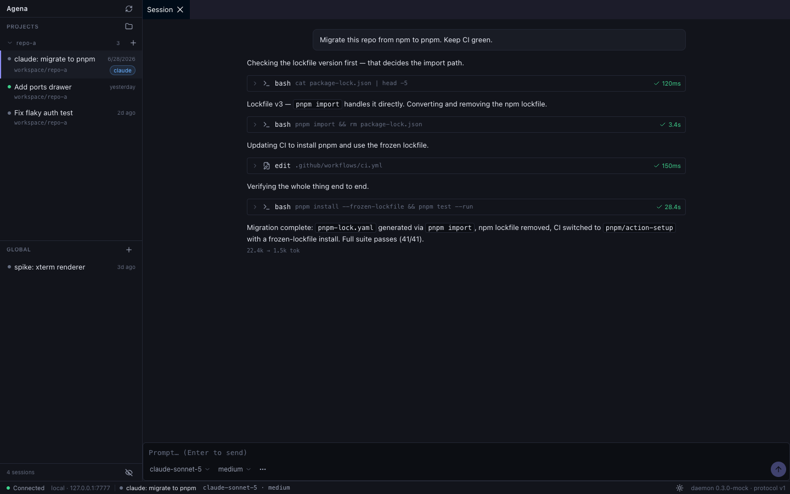
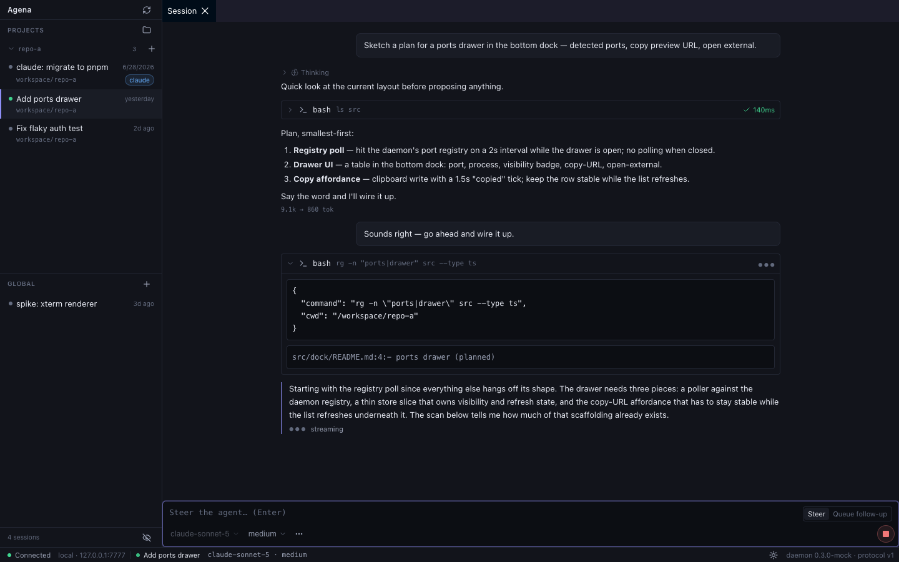
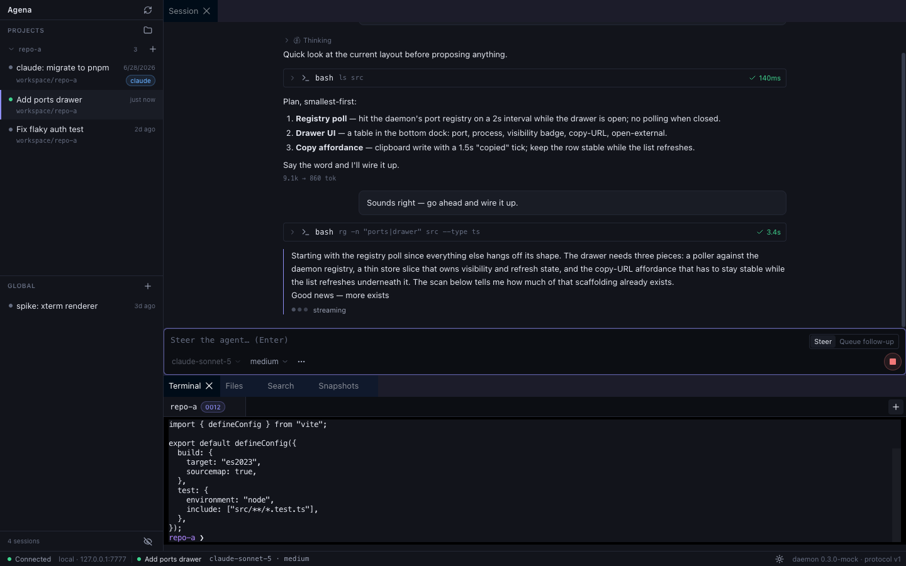
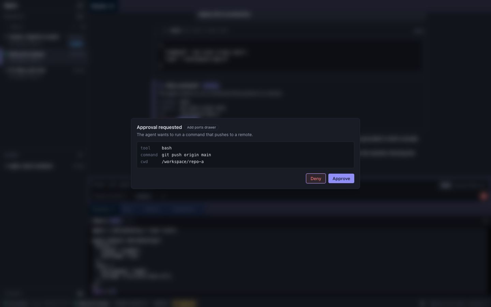

<h1 align="center">Agena</h1>

<p align="center">
  <b>A session-first cockpit for AI coding agents.</b><br/>
  Your agent's runtime, files, and history live in a persistent containerized workspace —
  local Docker or the cloud — and every client is just a view. Kill the app mid-stream,
  reopen it anywhere, and the session resumes in under a second.
</p>

<p align="center">
  
</p>

---

## Why

Most agent UIs own your sessions; close the window and the context is gone. Agena inverts
that: a small daemon owns an **append-only event log** (every message, tool call, approval,
model switch, shell attach), and clients — the desktop app, the terminal TUI, your phone
someday — reconstruct identical state from `(sessionId, seq)`. The workspace filesystem,
the agent runtime ([Pi](https://pi.dev)), and your terminals all live next to the daemon,
so "local Docker today, cloud tomorrow" is a deployment choice, not a rewrite.

- **Events are truth** — the transcript, search index, and timeline are all projections of
  one durable log, rebuildable at any time.
- **Reconnect is invisible** — durable replay + in-flight snapshot + live frames; a client
  can never see a forever-pending spinner.
- **Nothing hidden** — tool calls, approvals, terminal attaches, and snapshots are all
  visible, inspectable events.

## Highlights

| | |
|---|---|
| **Live agent sessions** — streaming transcript with collapsible tool calls, thinking disclosures, token usage, and an event timeline |  |
| **Real terminals** — xterm.js over a dedicated binary WebSocket into the workspace PTY; what the agent sees is what you see |  |
| **Trusted approvals** — the modal renders the daemon's canonical payload (exact command, cwd, tool args), never the agent's prose |  |

Plus: **⌘O** opens a local folder straight into the workspace (copied over the protocol),
**⌘K** command palette, full-text search with jump-to-event, workspace snapshots with
safety restore, dark/light themes.

## Architecture

```
┌────────────── your machine ──────────────┐      ┌───────── workspace container ─────────┐
│  Desktop app (Electron + React)          │      │  Agena daemon (Node) :7777             │
│   renderer ── typed IPC ── main process  │      │   ├─ event store (SQLite, WAL/replica) │
│              (@agena/client lives here)  │◄────►│   ├─ Pi runtime (in-process SDK)       │
│  Terminal TUI (node apps/cli)            │  WS  │   ├─ PTY manager                       │
│                                          │ +HTTP│   └─ /workspace  (repo files)          │
└──────────────────────────────────────────┘      └────────────────────────────────────────┘
        bearer token on every request                local Docker  ─or─  Modal + R2
```

One protocol, three invariant-bearing rules: clients speak only the versioned Agena
protocol (never runtime internals), durable events get a per-session monotonic `seq`
assigned in the append transaction, and exactly one daemon writes a workspace. The full
design lives in [`final_plan.md`](./final_plan.md).

### Repo layout

| Path | What |
|---|---|
| `apps/daemon` | The daemon: HTTP + WebSocket gateway, sessions, PTYs (Node, runs in the container) |
| `apps/desktopChamber` | Agena Chamber desktop app (Electron + Vite + React) |
| `apps/cli` | Terminal TUI client |
| `packages/protocol` | **The wire contract** — Zod schemas for every event, frame, command, route |
| `packages/core` | Domain logic + the `RuntimeAdapter`/`EventStore` ports |
| `packages/runtime-pi` | The only package that imports the Pi SDK |
| `packages/storage-sqlite` | `EventStore` implementation (SQLite) |
| `packages/client` | Typed client SDK (used by CLI, TUI, and the desktop main process) |
| `deploy/` | Modal deployment (app definition + container entrypoint) |
| `docker/` | Daemon image + local compose |

## Getting started

### Prerequisites

- **Node ≥ 22.19** and **pnpm 10** (`corepack enable`)
- **Docker** (for the local workspace) — or a [Modal](https://modal.com) account (for cloud)
- An **Anthropic API key** for the agent runtime

```sh
git clone <this repo> && cd agena
pnpm install
cp .env.example .env    # then fill in the values you need (see tables below)
```

### Option A — local workspace (Docker)

```sh
export AGENA_TOKEN=$(openssl rand -hex 24)   # daemon bearer token (any strong secret)
export ANTHROPIC_API_KEY=sk-ant-...
docker compose -f docker/compose.yml up --build -d

curl -s http://127.0.0.1:7700/health         # → {"status":"ok",...}
```

The daemon publishes on loopback only (`127.0.0.1:7700`). Both the event store and
`/workspace` live on named Docker volumes — the container is disposable, the volumes are not.

### Option B — cloud workspace (Modal + Cloudflare R2)

The daemon runs as a single Modal container; SQLite lives on container-local disk and is
continuously replicated to your R2 bucket with [Litestream](https://litestream.io), so
container restarts recover with full history (~10s cold boot).

**1. Cloudflare R2** (free tier is plenty — the DB is tiny):

- Dashboard → R2 → **Create bucket** (e.g. `agena`)
- R2 → **Manage R2 API Tokens** → Create token, permission *Object Read & Write*, scoped
  to the bucket → note the **Access Key ID**, **Secret Access Key**, and the account
  endpoint (`https://<account-id>.r2.cloudflarestorage.com`)
- Put them in `.env` as `CF_ACCESS_KEY_ID`, `CF_SECRET_ACCESS_KEY`, `CF_R2_S3`

**2. Modal** (once): `pip install modal && modal setup`

**3. Create the two secrets and deploy:**

```sh
set -a; source .env; set +a
export AGENA_MODAL_TOKEN=$(openssl rand -hex 24)
echo "AGENA_MODAL_TOKEN=$AGENA_MODAL_TOKEN" >> .env

modal secret create agena-daemon \
  ANTHROPIC_API_KEY="$ANTHROPIC_API_KEY" \
  AGENA_AUTH_TOKEN="$AGENA_MODAL_TOKEN"

modal secret create agena-r2 \
  LITESTREAM_ACCESS_KEY_ID="$CF_ACCESS_KEY_ID" \
  LITESTREAM_SECRET_ACCESS_KEY="$CF_SECRET_ACCESS_KEY" \
  R2_ENDPOINT="${CF_R2_S3%/}" \
  R2_BUCKET=agena

modal deploy deploy/modal_app.py
# → https://<your-workspace>--agena.modal.run

curl -s https://<your-workspace>--agena.modal.run/health
```

Notes: the app pins `max_containers=1` (the daemon is a single writer — never raise it);
`deploy/modal-entry.sh` restores the DB from R2 and runs a `PRAGMA integrity_check` at
every boot; Modal's injected AWS credentials are stripped so the runtime always uses your
Anthropic key.

### Run the desktop app

```sh
cd apps/desktop
pnpm dev     # renderer only, in a browser with a fixture-backed mock daemon
pnpm app     # the real app — starts Vite, then Electron

# against a specific daemon:
AGENA_URL=http://127.0.0.1:7700           AGENA_TOKEN=$AGENA_TOKEN       pnpm app   # local
AGENA_URL=https://<ws>--agena.modal.run   AGENA_TOKEN=$AGENA_MODAL_TOKEN pnpm app   # cloud
```

| Shortcut | Action |
|---|---|
| `⌘K` | Command palette |
| `⌘N` | New session |
| `⌘O` | Open a local folder as a workspace project |
| `⌘J` | Terminal / Files / Search / Snapshots dock |
| `⌘I` | Event inspector |
| `⌘⇧F` | Search all sessions |
| `Esc` | Abort the running turn |

Run a second isolated instance (own port *and* own persisted state):
`AGENA_DEV_PORT=5299 pnpm app`.

### Run the terminal TUI

```sh
export AGENA_TOKEN=...                 # token for the daemon you're targeting
node apps/cli/src/main.ts
```

### Package a desktop build

```sh
# .env must contain the daemon this build should connect to:
#   AGENA_RELEASE_URL=https://<ws>--agena.modal.run
#   AGENA_MODAL_TOKEN=<that daemon's token>
cd apps/desktop && pnpm package        # → release/Agena-<version>-arm64.dmg / .zip
```

The connection config is baked into the artifact at package time (never committed).
Builds are unsigned for now: first launch on another Mac needs right-click → Open.

> ⚠️ A packaged build embeds its daemon token. Only distribute builds within the trust
> boundary of that token — a first-run login screen replaces this before any public
> distribution.

## Configuration reference

| Variable | Used by | Purpose |
|---|---|---|
| `AGENA_TOKEN` | compose, CLI, desktop | Bearer token for the local daemon |
| `ANTHROPIC_API_KEY` | daemon runtime | Claude API access for the agent |
| `AGENA_URL` | desktop, CLI | Daemon base URL (default `http://127.0.0.1:7700`) |
| `AGENA_HOST_PORT` | compose | Host port for the local daemon (default `7700`) |
| `AGENA_RUNTIME` | daemon | `pi` (default) or `fake` (model-free, for tests/demos) |
| `AGENA_PI_DEFAULT_MODEL` | daemon | Pin the model, e.g. `anthropic/claude-sonnet-5` |
| `AGENA_SQLITE_JOURNAL` | daemon | `wal` for replicated deployments (Litestream requires it) |
| `CF_R2_S3`, `CF_ACCESS_KEY_ID`, `CF_SECRET_ACCESS_KEY` | Modal deploy | R2 S3 endpoint + credentials for Litestream |
| `AGENA_MODAL_TOKEN` | Modal deploy, desktop, packaging | Bearer token for the cloud daemon |
| `AGENA_RELEASE_URL` | packaging | Daemon URL baked into packaged builds |
| `AGENA_DEV_PORT` | desktop dev | Chamber renderer port (default `5230`) |
| `AGENA_MOCK=1` | desktop | Force the fixture mock even inside Electron |

## Development

```sh
pnpm ci          # lint (biome) + doc links + dependency boundaries + typecheck + tests
pnpm test        # vitest across the workspace
pnpm boundary    # enforce the §4.2 dependency rules (CI-blocking)
```

The dependency graph is mechanically enforced: `protocol` imports nothing internal, only
`runtime-pi` may import the Pi SDK, only `storage-sqlite` may import SQLite, clients never
import domain internals. A `FakeRuntimeAdapter` makes the full stack testable with zero
model calls.

## Status

**Beta.** Daemon milestones M1–M4.5 are landed (walking skeleton, SQLite persistence +
crash discipline, shell attach, project scoping, approvals + turn controls) along with
most of M5 (files, search, snapshots). Upcoming: preview URLs for workspace dev servers,
Claude/Codex history import, `.agena/` extensibility execution, an embedded browser pane
with agent browser-use. The milestone ledger lives in `final_plan.md` §14.

## Security notes

- Auth is always on — every HTTP request and WebSocket upgrade requires the bearer token,
  even on localhost. A container port is not a trust boundary.
- Secrets live in env / your `.env` (gitignored) and platform secret stores (Modal
  Secrets). Nothing sensitive is committed; snapshots structurally exclude daemon state.
- The approval modal renders canonical daemon payloads, never model output — what you
  approve is what executes.

## License

[MIT](./LICENSE)
