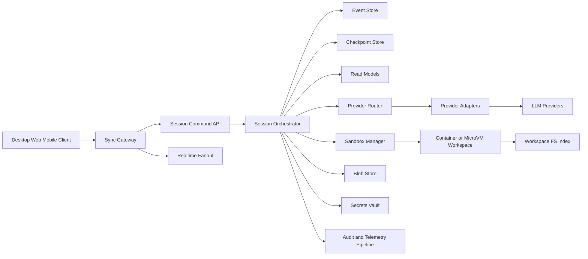
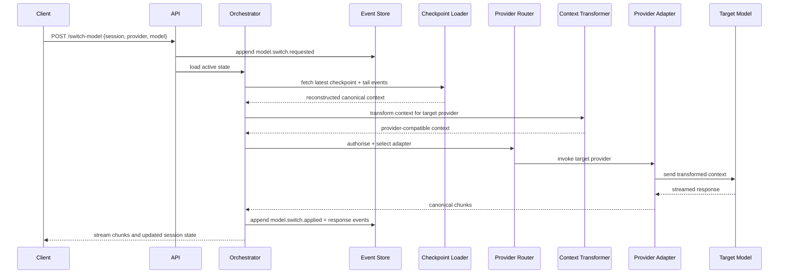
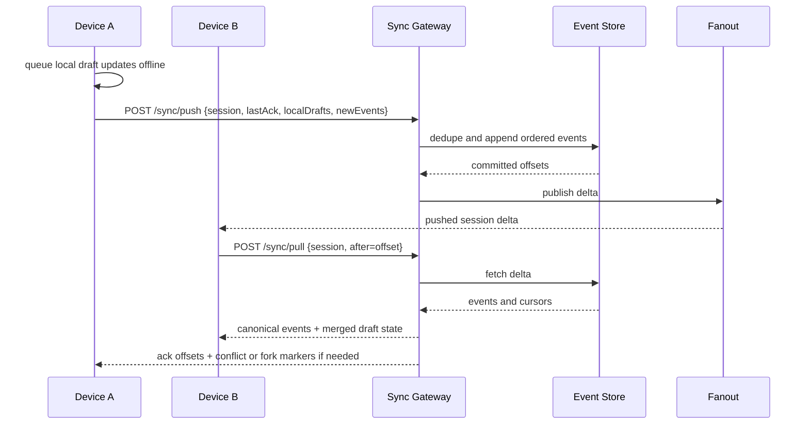
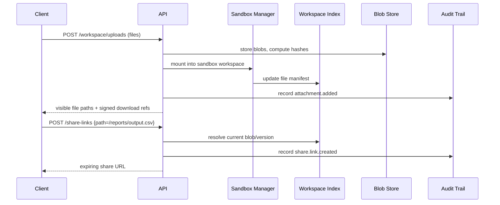

# Cloud-Backed Multi-Model Harnesses

## Executive summary

The current landscape splits into two broad families. Local-first coding harnesses such as **OpenCode** and **Pi** persist session state primarily on the local machine, expose explicit session continuation and branching, and treat model switching as a session-local operation. Server-first platforms such as **Open WebUI** and **LibreChat** already give users multi-device continuity, centralised file handling, and multi-user access controls, but their public architecture tends to be less explicit about branch-aware event logs and checkpoint semantics than Pi or LangGraph. Supporting frameworks such as **LangGraph**, **OpenHands**, and the **AI SDK** contribute important architectural ideas: checkpointed graph state, separation of base state from append-only events, provider abstraction, resumable streaming, and instrumentation hooks. citeturn14view0turn14view2turn14view3turn33view3turn34view3turn13view1turn11view7turn12view3turn17view0turn14view12turn16view1turn29search5

The strongest design pattern for a cloud-backed harness is therefore **hybrid rather than purely local-first or purely server-first**. The durable source of truth should be an **append-only event log** per session branch, paired with **materialised projections** for fast UI reads and **periodic checkpoints** for cheap resume, compaction, audit, and fault recovery. Provider-specific transcripts should not be stored as the primary state model. Instead, the system should preserve a **canonical provider-neutral message and tool schema**, plus explicit **model-switch events** and a **context transformation layer** that maps provider-native reasoning, tool-call, and tool-result formats into that canonical schema. Pi’s cross-provider handoff design is the clearest currently documented exemplar of this idea. citeturn19view1turn19view3turn34view0turn17view0turn14view12turn20search2turn20search5

For **session sync across devices**, the most robust default is **server-ordered event sourcing** with **offline-capable local caches** and **cursor-based reconciliation**. For expensive, side-effecting operations such as provider calls, shell commands, and file writes, the server should remain authoritative. For low-risk local edits such as draft prompts, notes, and client-side annotations, a local-first sync layer can be added with **CRDT-backed** or fork-on-conflict behaviour, depending on the object type. That balance matches the lessons from local-first research: offline-first replication is excellent for user-owned documents and draft state, but not ideal as the only coordination model for transactions, secrets, or costly external side effects. citeturn20search0turn20search1turn20search4

The recommended architecture is a **control plane plus workspace plane**. The control plane handles identity, sessions, events, model routing, provider credentials, observability, audit, sharing, and sync. The workspace plane runs each active session in a **sandbox** such as a container or microVM with a virtual file API, streamed logs, preview ports, and file manifests. This should expose a **local-filesystem-like UX**—browse, upload, download, diff, publish, mount—without giving the client raw host-machine access. OpenHands, Open WebUI, and LibreChat already show three pieces of that puzzle: isolated sandboxes, file browsers, and session-organised file handling. citeturn27search0turn35view4turn12view8turn14view8turn27search7turn27search3

In practice, the best migration path is incremental. Start by wrapping local harnesses with **import/export adapters** and provider registries; then add cloud event storage and sync; then add remote sandboxes, shareable file objects, fine-grained access control, and audit; and only later add more ambitious local-first collaboration primitives. This reduces re-platforming risk while preserving compatibility with existing tools and session archives from OpenCode, Pi, and adjacent systems. citeturn32view0turn32view1turn33view0turn33view1turn17view4

## Comparative landscape

The most useful comparison lens is not “which product is best”, but **which architectural primitive each project treats as first-class**. Some treat the session as a local file, some as database rows, some as checkpointed graph state, and some as a stream of events. For building a cloud-backed harness, the most reusable ideas come from the projects that make state transitions explicit rather than implicit. citeturn34view3turn11view7turn17view0turn14view12turn16view1

### Existing projects and their approaches

| Project | Session storage mechanism | State model, logs, checkpoints | Mid-session model switching | File/workspace handling | Sync, auth, and security shape | Sources |
|---|---|---|---|---|---|---|
| **OpenCode** | Local application data under `~/.local/share/opencode/`; project data under project/global storage directories. It also supports export/import of session JSON and optional server sync for shared conversations. | Session/message data are persisted locally; snapshots are enabled by default and track agent file changes via an internal Git repository; compaction can run automatically when context is full. | Model selection is exposed via `/models`, CLI `--model`, and per-message server API fields (`model?`). Agent switching is first-class inside a session. | Server API exposes file listing, file reading, search, symbols, and tracked-file status against the current workspace. | Mostly local-first. Optional `/share` syncs conversation history to OpenCode servers and publishes a public URL. Enterprise mode emphasises central config, SSO, and forcing all traffic through an internal AI gateway. | citeturn14view0turn14view2turn14view3turn10view3turn18view3turn18view4turn7view2turn25view1 |
| **Pi** | JSONL session files under `~/.pi/agent/sessions/...`; credentials and trust decisions are also local files. | Explicit tree-structured event log in a single JSONL file. Entry types include `message`, `model_change`, `thinking_level_change`, `compaction`, `branch_summary`, labels, and custom entries. Sessions auto-migrate across format versions. | Explicitly documented. `/model` and `Ctrl+L` switch models mid-session; a `model_change` entry is appended. Cross-provider handoffs preserve tool calls/results and transform incompatible reasoning blocks into tagged text. | Strong local coding-harness affordances: fuzzy file reference, shell commands, context files, and project resources. Session export/import and gist-based sharing are supported. | Strongly local-first. Provider auth supports OAuth, API keys, auth file, environment variables, and custom providers. Security docs are explicit that Pi has **no built-in sandbox** and should be containerised or isolated for untrusted work. | citeturn34view3turn34view0turn10view7turn19view1turn33view3turn33view1turn31view0turn31view2turn24view0turn24view2 |
| **Open WebUI** | Internal SQLite database at `data/webui.db`, with adjacent `uploads/` and `vector_db/` directories. Some configuration variables are persisted internally after first launch. | Database-backed chat history with tables for messages, memory, models, OAuth sessions, and more. Conversation continuity is server-owned rather than file-owned. | Officially supports switching models mid-conversation while keeping context intact. Multi-model chats are also exposed in the UI. | Centralised file manager for uploaded files, document handling for RAG, and a terminal-connected file browser that behaves like a desktop file explorer. | Multi-user by design, with local auth, SSO/OIDC, LDAP, SCIM, RBAC, per-resource access control, API keys, and hardening guidance for TLS via reverse proxy and private-network deployment. It is also designed to operate entirely offline when self-hosted. | citeturn11view7turn26view6turn12view7turn13view1turn14view7turn12view8turn26view0turn22view6turn26view3turn21search19 |
| **LibreChat** | MongoDB is the core database; Redis is used for resumable streams in horizontally scaled deployments; Meilisearch powers conversation search. | Server-first conversation model with projects, forks, message search, shareable links, temporary chat, and persistent user memory as a key/value store. | Endpoint and model can be selected via URL query parameters even for an existing conversation route. Agents also let users choose providers/models. | Code Interpreter provides isolated sandboxes with session-based file organisation, uploads, downloads, and secure file handling. | Multi-user auth with email/social login and broader enterprise auth options in docs; read-only share links, resumable streams across tabs/devices, and Redis-backed cross-instance coordination. | citeturn12view2turn14view10turn12view4turn14view8turn11view8turn14view9turn36search0turn36search4turn36search3turn36search2 |
| **OpenHands** | Per-conversation directories with `base_state.json` plus `events/event-*.json`. | Explicit separation of overwritten base state from incrementally appended events; automatic persistence on state mutation; event files can be re-read and converted into LLM-ready messages. | Not primarily marketed as “switch model mid-session” in the same way as Pi, but persisted agent configuration includes LLM settings, tools, MCP servers, and execution state, and the platform exposes model options and an OpenAI-compatible endpoint. | Strong workspace APIs: list visible files, fetch content, upload files, download archive, Git changes/diff. Sandboxes can be Docker, process, or remote. | Production-oriented security and operations: sandbox providers, confirmation policies, pluggable security analyzers, secret registry, built-in metrics and OpenTelemetry tracing. | citeturn17view3turn17view4turn17view0turn17view2turn23view2turn23view1turn27search7turn27search3turn35view4turn35view2turn35view0turn35view1 |
| **LangGraph** | Checkpointers persist per-thread graph state; stores persist application-defined data across threads. | Snapshot-oriented graph execution model: checkpoints at each super-step support time travel, conversational memory, human-in-the-loop workflows, and fault tolerance. | Model routing is outside the persistence abstraction; the important reusable idea is checkpointed continuity independent of any specific provider. | Not a workspace/file product by itself. | Best viewed as a state-management substrate for agent runtimes, not a full end-user harness. | citeturn14view12turn14view13 |
| **AI SDK by Vercel** | Application-defined persistence. Official examples store `UIMessage[]` and recommend persisting the front-end message format, not only provider-native messages. | Unified provider/model abstraction, middleware for logging/caching/guardrails, custom providers, provider registries, and resumable stream patterns. | Switching is easy because the SDK standardises provider access and exposes registries, aliases, custom providers, OpenAI-compatible providers, and middleware. | Not a full filesystem harness, but a strong provider/runtime substrate. | Excellent adapter layer for a cloud harness: provider-neutral APIs, custom provider writing, middleware hooks, and explicit message persistence examples. | citeturn16view1turn16view2turn16view4turn16view5turn29search5turn29search4turn29search7turn29search1 |

### What the comparison implies

A clear pattern emerges. **OpenCode and Pi** are better models for **branch-aware session semantics**, **explicit model-switch records**, and **developer-local workflows**. **Open WebUI and LibreChat** are better models for **multi-device continuity**, **account-level access control**, and **centralised file handling**. **OpenHands and LangGraph** are better models for **formal runtime state**, **checkpointing**, and **recoverable execution**. The **AI SDK** is the cleanest reusable implementation substrate for multi-provider routing when building in TypeScript. citeturn14view2turn34view0turn13view1turn36search0turn17view0turn14view12turn29search5

The most important architectural gap in the current end-user harnesses is that **cloud sync and branch-aware event sourcing rarely coexist cleanly**. Local CLIs usually have better lineage and switch semantics, while web platforms usually have better multi-device UX and auth. A cloud harness that combines both should treat **event sourcing, checkpoints, provider adaptation, and sandboxed files** as separate but coordinated subsystems. citeturn34view3turn17view0turn14view12turn36search4

## Architectural design

The recommended design is a **cloud-backed, event-sourced harness with local-first caches**, built around a **canonical session graph** rather than provider-native transcripts. The key principle is simple: **provider APIs are transient execution backends; the harness owns the durable session model**. That principle matches the way Pi normalises cross-provider handoffs, the way OpenHands separates events from base state, and the way LangGraph treats checkpoints as an independent persistence concept. citeturn19view1turn17view0turn14view12

### Architectural stance

The proposed system should use:

- a **canonical message schema** for user messages, assistant messages, reasoning/tool blocks, tool results, system notes, and model-switch metadata;
- an **append-only event log** per session branch;
- **checkpoint snapshots** every _N_ events or _M_ tokens;
- a **provider router** and **adapter layer** that transform canonical context into provider-specific requests and canonicalise responses on the way back;
- a **sandbox manager** for per-session or per-branch workspaces;
- a **content-addressed file store** for attachments, workspace snapshots, and exports;
- **read models** for fast UI queries such as recent messages, file tree, sharing, and search;
- **device cursors** and **local caches** for sync and offline support. This architecture combines the auditability of event sourcing with the performance benefits of snapshots and projections. citeturn20search2turn20search5turn17view0turn14view13turn20search1



The control plane should remain stateless wherever possible, except for strongly ordered session appends. That means session writes should flow through a single ordering point per session—usually a database transaction or lightweight per-session leader—while reads, streams, exports, and search can be served from projections and caches. This preserves consistency exactly where it matters: ordering user intent, model-switch decisions, tool executions, and file mutations. citeturn20search5turn17view0turn14view12

### Recommended core data model

| Object | Purpose | Storage suggestion | Why |
|---|---|---|---|
| `session` | Logical conversation root, ownership, project refs, privacy mode, active branch pointer | PostgreSQL row | Transactional updates, relational integrity |
| `session_event` | Append-only ordered events for messages, tool calls/results, model switches, file ops, sync cursors | PostgreSQL append table with JSONB payload | Strong ordering, auditability, easy projections; aligned with event-sourcing guidance and OpenHands/Pi-style logs. citeturn20search5turn17view0turn34view3 |
| `checkpoint` | Compacted state snapshot at a sequence number | Object storage plus SQL metadata | Cheap resume and time travel; similar in spirit to LangGraph checkpointers and OpenHands base state. citeturn14view13turn17view0 |
| `workspace` | Sandbox metadata, runtime class, filesystem root, lifecycle state | SQL row | Operational coordination |
| `workspace_file_manifest` | Current logical file tree, blob hashes, sandbox path mappings | SQL projection | Enables fast “local-filesystem-like” browse UX |
| `blob` | Attachments, exports, binary artifacts, checkpoint payloads | S3/R2/GCS/Azure Blob | Cheap scalable storage |
| `device_cursor` | Per-device sync offset, local draft state, last acked event | SQL or Redis+SQL | Efficient multi-device sync |
| `share_link` | Stable or expiring public/private shared views | SQL + signed blob/object refs | Separate sharing from core session storage |
| `audit_event` | Security and compliance trail | ClickHouse or append-only warehouse | Long retention and cheap analytics |
| `secret_ref` | Provider credentials and per-session tokens | Vault/KMS-wrapped secret store | Keeps secrets out of session payloads |

### Storage choices and trade-offs

A pragmatic first version should keep the **ordered source of truth** in PostgreSQL, not Kafka. The event volumes of most coding harnesses are modest enough that transactional ordering and query simplicity matter more than streaming throughput. Once the platform reaches very high fanout or cross-region requirements, an outbox pattern or streaming bus can be introduced without changing the session model.citeturn20search5turn17view0

Object storage should hold attachments, exports, binary artifacts, full checkpoint payloads, and optional workspace snapshot tarballs. Search should be optional and tiered: start with PostgreSQL full-text/trigram for session titles and projections, then add Meilisearch or OpenSearch only when global search quality or scale demands it. LibreChat’s Meilisearch integration is a useful reference for when dedicated search becomes worthwhile. citeturn36search3turn36search7

For offline support, local caches should persist recent events, prompts, drafts, and small attachment manifests on-device. The **authoritative merge strategy should differ by object type**:

- **append-only side effects** such as model calls, tool runs, and writes to shared workspaces: server-ordered only;
- **draft text and annotations**: CRDT or client-side merge;
- **binary attachments**: dedupe by content hash and avoid merge;
- **competing workspace edits**: either serialise through sandbox ownership or fork the session branch. This is directly in line with CRDT and local-first literature, which emphasises convergence for user data but does not remove the need for stronger coordination around side effects. citeturn20search0turn20search1turn20search4

## Data model and APIs

The APIs should expose the session as a **branch-aware stream of typed events**, not just as “messages”. A message is only one event type. Others include model switches, tool invocations, tool outputs, workspace mutations, checkpoint markers, share-publish actions, and local-draft sync. This is the simplest way to support auditability, resumability, and cross-device continuity without overloading the message schema. citeturn34view0turn17view0turn14view13

### Canonical event types

A recommended minimum event taxonomy:

```text
session.created
session.renamed
branch.created
message.user.appended
message.assistant.started
message.assistant.chunk
message.assistant.completed
message.assistant.aborted
model.switch.requested
model.switch.applied
context.compacted
tool.call.started
tool.call.completed
tool.call.failed
workspace.file.upserted
workspace.file.deleted
workspace.command.started
workspace.command.completed
attachment.added
share.link.created
checkpoint.created
device.cursor.updated
draft.updated
presence.updated
```

The canonical **assistant content model** should preserve:
`text`, `reasoning`, `tool_call`, `tool_result`, `image_ref`, `file_ref`, `citation`, `annotation`, and `partial`. Pi’s documentation is especially persuasive here because it already shows why the harness must preserve tool blocks and reasoning across provider handoffs instead of flattening everything into plain text. citeturn19view1turn34view2

### Sample HTTP endpoints

```http
POST   /v1/sessions
GET    /v1/sessions/{session_id}
GET    /v1/sessions/{session_id}/events?after=1842&limit=500
POST   /v1/sessions/{session_id}/events
POST   /v1/sessions/{session_id}/switch-model
POST   /v1/sessions/{session_id}/compact
POST   /v1/sessions/{session_id}/branches
POST   /v1/sessions/{session_id}/share-links
GET    /v1/sessions/{session_id}/workspace/files?path=/
GET    /v1/sessions/{session_id}/workspace/file-content?path=/src/app.ts
POST   /v1/sessions/{session_id}/workspace/uploads
POST   /v1/sessions/{session_id}/workspace/commands
GET    /v1/sessions/{session_id}/checkpoints
POST   /v1/sync/push
POST   /v1/sync/pull
GET    /v1/providers
GET    /v1/models
POST   /v1/provider-tokens
```

Recommended WebSocket or SSE channels:

```text
/ws/sessions/{session_id}/stream
/ws/sessions/{session_id}/presence
/ws/sessions/{session_id}/workspace/logs
/ws/sessions/{session_id}/workspace/files
```

### Sequence diagram for model switching

The sequence below reflects the strongest documented ideas in Pi, OpenCode, and provider-abstraction frameworks: record the switch explicitly, normalise historical context, route through an adapter, and continue streaming in the same session. citeturn34view0turn18view3turn29search5turn19view3



### Sequence diagram for device sync and offline reconciliation

This pattern keeps the server authoritative for ordered session events while still letting devices work smoothly across network drops and reconnects, much as LibreChat’s resumable streams do for interrupted responses. citeturn36search0turn36search4turn20search1



### Sequence diagram for sandboxed file sharing

This is the critical path for “local-filesystem-like” sharing without exposing the host filesystem directly.



### Pseudocode for session capture

```ts
type SessionEvent =
  | { type: "message.user.appended"; sessionId: string; branchId: string; eventId: string; payload: { parts: any[] } }
  | { type: "message.assistant.chunk"; sessionId: string; branchId: string; eventId: string; payload: { part: any } }
  | { type: "message.assistant.completed"; sessionId: string; branchId: string; eventId: string; payload: { usage: Usage; modelRef: ModelRef } }
  | { type: "checkpoint.created"; sessionId: string; branchId: string; eventId: string; payload: { checkpointId: string } };

async function capturePrompt(input: {
  sessionId: string;
  branchId: string;
  userParts: any[];
  modelRef: ModelRef;
}) {
  const tx = await db.begin();
  try {
    const userEvent = {
      type: "message.user.appended",
      sessionId: input.sessionId,
      branchId: input.branchId,
      eventId: generateId(),
      payload: { parts: input.userParts },
    } satisfies SessionEvent;

    await eventStore.append(tx, userEvent);

    const state = await reconstructState({
      tx,
      sessionId: input.sessionId,
      branchId: input.branchId,
    });

    const providerContext = contextTransformer.forProvider(state, input.modelRef.provider);

    const stream = providerRouter.stream({
      modelRef: input.modelRef,
      context: providerContext,
    });

    for await (const chunk of stream) {
      await eventStore.append(tx, {
        type: "message.assistant.chunk",
        sessionId: input.sessionId,
        branchId: input.branchId,
        eventId: generateId(),
        payload: { part: canonicaliseChunk(chunk) },
      });
      realtime.publish(input.sessionId, chunk);
    }

    const final = await stream.final();
    await eventStore.append(tx, {
      type: "message.assistant.completed",
      sessionId: input.sessionId,
      branchId: input.branchId,
      eventId: generateId(),
      payload: {
        usage: final.usage,
        modelRef: input.modelRef,
      },
    });

    if (shouldCheckpoint(state, final)) {
      const checkpointId = await checkpointStore.write(input.sessionId, input.branchId, await buildCheckpoint(state));
      await eventStore.append(tx, {
        type: "checkpoint.created",
        sessionId: input.sessionId,
        branchId: input.branchId,
        eventId: generateId(),
        payload: { checkpointId },
      });
    }

    await tx.commit();
  } catch (err) {
    await tx.rollback();
    throw err;
  }
}
```

### Pseudocode for safe model switching

```ts
async function switchModel(input: {
  sessionId: string;
  branchId: string;
  target: ModelRef;
  actorId: string;
}) {
  return db.transaction(async (tx) => {
    const state = await reconstructState({ tx, sessionId: input.sessionId, branchId: input.branchId });

    await policy.assertModelAllowed({
      actorId: input.actorId,
      tenantId: state.tenantId,
      target: input.target,
    });

    await eventStore.append(tx, {
      type: "model.switch.requested",
      sessionId: input.sessionId,
      branchId: input.branchId,
      eventId: generateId(),
      payload: { target: input.target, previous: state.activeModel },
    });

    const transformed = contextTransformer.forProvider(state, input.target.provider, {
      preserveReasoningAsTaggedText: true,
      preserveToolBlocks: true,
    });

    // Optional dry-run validation before committing the switch
    await providerRouter.validateContext({ modelRef: input.target, context: transformed });

    await eventStore.append(tx, {
      type: "model.switch.applied",
      sessionId: input.sessionId,
      branchId: input.branchId,
      eventId: generateId(),
      payload: { target: input.target },
    });

    realtime.publish(input.sessionId, {
      type: "session.model.changed",
      model: input.target,
    });
  });
}
```

### Pseudocode for device sync

```ts
async function syncPush(input: {
  deviceId: string;
  sessionId: string;
  afterOffset: number;
  drafts: DraftPatch[];
  pendingEvents: SessionEvent[];
}) {
  return db.transaction(async (tx) => {
    const cursor = await deviceCursorStore.get(tx, input.sessionId, input.deviceId);

    const dedupedEvents = dedupeByClientEventId(input.pendingEvents, cursor?.seenClientEventIds ?? []);
    const committed = await eventStore.appendBatch(tx, input.sessionId, dedupedEvents);

    await draftStore.merge(tx, {
      sessionId: input.sessionId,
      deviceId: input.deviceId,
      patches: input.drafts, // CRDT or last-writer-wins depending on object type
    });

    await deviceCursorStore.upsert(tx, {
      sessionId: input.sessionId,
      deviceId: input.deviceId,
      lastAckOffset: committed.maxOffset,
    });

    return {
      committedOffsets: committed.offsets,
      conflicts: committed.conflicts, // empty for append-only events; populated for mutable draft objects
    };
  });
}
```

## Implementation roadmap

A successful rollout should minimise state-model disruption. The fastest path is to **adopt existing harnesses as compatibility sources first**, then gradually move the durable state model into the cloud platform.

### Recommended phases

| Phase | Goal | Deliverables | Why this order |
|---|---|---|---|
| **Compatibility layer** | Ingest and replay existing session histories | OpenCode JSON import/export bridge; Pi JSONL importer/exporter; provider registry; canonical event schema | Lets teams preserve existing transcripts and workflows immediately. OpenCode and Pi both already expose import/export paths. citeturn32view0turn32view1turn33view0turn33view1 |
| **Cloud event core** | Make cloud state authoritative for sync | Session/event API, Postgres event store, checkpoints, device cursors, WebSocket/SSE fanout | Establishes durable multi-device continuity before adding heavy workspace features. |
| **Provider routing layer** | Standardise multi-provider execution | Adapter SDK, model registry, aliasing, middleware hooks, switch validation, cost policy | Mirrors the strengths of AI SDK provider management and Pi/OpenCode normalisation. citeturn29search5turn29search4turn14view3turn19view1 |
| **Workspace plane** | Add isolated runtime and filesystem semantics | Container/microVM sandboxes, file manifest service, uploads/downloads, preview ports, diff API | Makes the harness useful for coding and document workflows, not just chat. |
| **Enterprise controls** | Add tenancy, auth, audit, retention | OIDC/SCIM, encryption, RBAC/ABAC, immutable audit, data residency, per-tenant quotas | Aligns with production requirements shown in Open WebUI, LibreChat, and OpenCode Enterprise. citeturn26view0turn22view4turn25view1 |
| **Local-first enhancements** | Improve offline and collaboration ergonomics | CRDT notes/drafts, fork-on-conflict, offline file queue, local cache encryption | Worth doing after server ordering and sandbox boundaries are stable. citeturn20search0turn20search1 |

### Tech stack options

A **TypeScript-heavy stack** is the most natural fit when the goal is to build on ideas from OpenCode and the AI SDK. A practical baseline is **Next.js or React front-end**, **Fastify/NestJS** for APIs, **PostgreSQL** for authoritative session/event data, **Redis/Valkey** for transient fanout and resumable state, and **S3-compatible object storage** for blobs. This make-up aligns particularly well with AI SDK middleware, provider registries, custom providers, and UI message persistence. citeturn16view1turn16view4turn29search5turn29search1

A **Python control plane** becomes attractive if the roadmap leans heavily on OpenHands-compatible runtimes, existing agent SDKs, or LangGraph-based orchestration. In that case, the event-store and sync design should stay the same, but the orchestrator and sandbox services can be Python-first. OpenHands already demonstrates that Python stacks can expose a clean REST/OpenAI-compatible facade while retaining deep internal event/state semantics. citeturn23view1turn17view0turn35view0

A **polyglot split** is often optimal: TypeScript for the product-facing API and provider registry, Go or Rust for the sync gateway if very high concurrency is required, and Python for agent runtimes and evaluator pipelines.

### Migration paths from current projects

**From OpenCode**: import exported JSON, map session/message records to canonical events, preserve snapshot metadata where available, and translate share URLs into immutable import bundles. Because OpenCode also has a server API with session/message endpoints and file APIs, a bridge adapter can be built before any full migration. citeturn32view0turn18view3turn14view2

**From Pi**: JSONL import is even more straightforward because the session format is already an event log. `message`, `model_change`, `compaction`, `branch_summary`, and custom entries should map almost one-to-one into the cloud schema. Pi’s tree structure can become native branch history in the cloud harness rather than being flattened. citeturn34view3turn34view0turn10view7

**From Open WebUI and LibreChat**: treat existing conversations as imported branches with provider/model metadata. Since these are server-first systems, the migration challenge is less about sync and more about remapping message rows, file references, and per-user permissions into the new canonical model. Where exact branch lineage is unavailable, imported sessions should be marked as “linear legacy threads”. citeturn11view7turn26view6turn12view2turn14view10

**From OpenHands or LangGraph**: preserve checkpoints and event trajectories. OpenHands already persists base state and events separately; LangGraph already persists checkpoints per thread. Both can be ingested as durable execution history for advanced agent sessions. citeturn17view0turn17view4turn14view12turn14view13

## Security compliance and scalability

Security needs to be designed around the fact that a cloud harness is simultaneously handling **developer source code**, **provider credentials**, **sandbox execution**, and **cross-device sync**. In that threat model, the most important distinction is between **control-plane isolation** and **workspace-plane isolation**. The control plane must protect identity, policies, and secrets; the workspace plane must protect runtime execution and filesystem access. Pi’s security documentation is unusually candid that local harnesses without real sandboxing are not safe for untrusted work. A cloud harness should treat that as a design requirement, not an optional extra. citeturn24view2turn35view4turn35view3

### Identity, auth, and authorisation

The recommended baseline is **OIDC/OAuth for user authentication**, **SCIM/LDAP for enterprise provisioning where needed**, **short-lived workspace/session tokens**, and **least-privilege provider credentials** retrieved from a vault at execution time. This follows the strongest patterns visible in Open WebUI’s multi-user/RBAC model, LibreChat’s authentication stack, and OpenCode Enterprise’s central-config-plus-SSO approach. citeturn26view0turn22view4turn25view1

The platform should implement:

- **tenant-level policy** for allowed providers, models, and tools;
- **project/session-level sharing scopes**;
- **role-based access** for normal users, reviewers, admins, and auditors;
- **attribute-based policy** for data residency, egress restrictions, and sandbox classes;
- **service-to-service identity** for sandbox agents and provider adapters.

### Encryption and secret handling

A robust minimum bar is:

- TLS in transit everywhere;
- envelope encryption for session rows and blobs;
- per-tenant and optionally per-conversation data-encryption keys;
- vault-backed storage for provider tokens and refresh credentials;
- secret redaction in logs, traces, terminal output, and exports.

These choices are strongly supported by current best practice across the surveyed stack. Open WebUI explicitly recommends TLS termination behind a reverse proxy, secure cookies, restricted trusted proxies, and verified outbound TLS. OpenHands documents secret masking and late injection into the workspace. Pi recommends short-lived credentials in contained environments. citeturn26view3turn26view4turn27search9turn24view2

### Multi-tenant isolation and sandbox policy

The cleanest model is **tenant namespace → session branch → sandbox instance**. The sandbox should be:

- **per session** for ordinary interactive work;
- **per branch** when users fork into divergent code paths or destructive experiments;
- **ephemeral by default**, with resumable checkpoints and optional retained workspaces;
- **network-restricted by policy**;
- **credential-scoped** only to the resources required for that session.

OpenHands’ published sandbox trade-offs are a useful reference point: Docker gives good isolation, process mode is unsafe but fast, and remote sandboxes fit hosted setups. For a cloud harness, microVMs improve tenant isolation where the threat model is stricter, while containers are typically more cost-efficient for trusted internal usage. citeturn35view4turn27search0turn27search20

### Auditability and compliance posture

If the harness will be used in regulated or enterprise environments, it should produce an immutable trail of:

- authentication events;
- provider-token access;
- model-switch decisions;
- prompt/response metadata;
- tool calls and workspace commands;
- file uploads/downloads/shares;
- policy denials and manual approvals.

Because the underlying session model is event-sourced, most of this comes “for free” if events are typed correctly. The important discipline is to separate **auditable metadata** from **sensitive content**, and to let tenants configure retention and redaction policy. OpenHands’ event/base-state split, Pi’s explicit switch entries, and OpenCode’s enterprise emphasis on internal gateways and disabling external sharing all reinforce this design. citeturn17view0turn34view0turn25view1

### Latency and consistency trade-offs

| Design choice | Benefit | Cost | Recommended default |
|---|---|---|---|
| **Strongly ordered event append per session** | Clean audit trail, deterministic replay, simpler switch semantics | Slightly higher write latency | Yes, for all provider calls and workspace side effects |
| **Aggressive checkpointing** | Faster resume, cheaper replay | More write amplification and storage | Checkpoint every token or event budget, not every event |
| **Full provider-native transcript persistence** | Easier raw debugging | Leaks abstraction, makes provider switching brittle | Store raw payloads only as debug artefacts with retention limits |
| **Local-first merge of everything** | Excellent offline UX | Hard to coordinate costly side effects and secrets | Use only for drafts, notes, and benign UI state |
| **Per-branch sandboxing** | Clear isolation between divergent experiments | Higher runtime cost | Enable on fork or on policy-triggered operations |
| **Dedicated search/vector infra from day one** | Rich discovery | Higher ops cost | Add only when actual product usage justifies it |

These trade-offs are consistent with event-sourcing guidance and local-first research: use strong ordering for side effects, and reserved eventual convergence for user-editable data that benefits from offline work. citeturn20search5turn20search0turn20search1

## UX observability and deployment economics

### UX patterns for seamless device switching

The best multi-device experience feels as if the user never “left” the session. LibreChat’s resumable streams and Open WebUI’s server-owned conversations show the principle clearly: the user should not have to re-open or reconstruct context after a tab crash, browser refresh, or switching from laptop to phone. citeturn36search0turn13view1

Recommended UX patterns:

| Pattern | Behaviour | Why it works |
|---|---|---|
| **Instant resume card** | On opening the app on a second device, show “Continue where you left off” with active session, active model, sandbox status, and recent file changes. | Reduces the cognitive cost of device switching. |
| **Live stream handoff** | If a response is still streaming, the second device shows the current partial output and can take over viewing seamlessly. | Mirrors the value of LibreChat’s resumable streams across tabs/devices. citeturn36search0turn36search4 |
| **Sticky workspace context** | Show the current sandbox, branch, and modified files in a compact status rail. | Makes branch/session/sandbox separation visible. |
| **Offline draft queue** | Unsynced prompt drafts are clearly marked and auto-merged on reconnect. | Good local-first ergonomics without risking duplicate provider calls. |
| **Conflict-as-fork** | If two devices diverge on the same branch during a disconnection, offer “merge benign drafts” or “create new branch”. | This matches how coding workflows already think about divergence. |
| **Switch-model breadcrumb** | When the model changes, insert a small timeline marker showing previous model, new model, and reason. | Keeps trust high and makes cost/performance decisions legible. |
| **Share scope chooser** | Sharing UI distinguishes session snapshot, single file, folder, artefact, or review bundle. | Prevents accidental over-sharing. |

### UX patterns for local-filesystem-like file sharing

Open WebUI’s terminal-connected file browser, LibreChat’s session-based sandbox file handling, and OpenHands’ workspace upload/list APIs point to the right mental model: users do not want “blob storage”; they want **a workspace that behaves like a file tree**. citeturn12view8turn14view8turn27search7turn27search3

The cloud harness should therefore distinguish three file classes in the UI:

- **workspace files**: mutable files inside the active sandbox;
- **attachments**: immutable uploaded inputs attached to a session or message;
- **published artefacts**: outputs intentionally surfaced for sharing or download.

The UX should support:

- folder browsing and fuzzy path search;
- drag-and-drop upload to current folder;
- right-click actions: open, diff, rename, download, copy path, publish, revoke share;
- previews for text, CSV, Markdown, images, PDFs, notebooks, and HTML artefacts;
- visible provenance: “uploaded by user”, “generated by assistant”, “copied from branch X”, “published from checkpoint Y”.

That gives users the familiarity of a local filesystem while still enforcing tenancy, audit, and sandbox boundaries.

### Recommended monitoring and visibility stack

A cloud harness of this sort should be instrumented end-to-end with **OpenTelemetry** for traces, metrics, and logs, because the critical debugging path crosses API handlers, provider adapters, sync services, and sandboxes. OpenHands already exposes OTEL tracing, and OpenTelemetry itself is designed precisely for correlated traces, metrics, and logs across services. citeturn35view0turn28search0turn28search7turn28search21

A practical stack looks like this:

| Layer | Recommendation | Why |
|---|---|---|
| **Instrumentation** | OpenTelemetry SDKs and collector | Vendor-neutral traces, metrics, and logs with shared context. citeturn28search0turn28search21 |
| **Metrics store and alerting** | Prometheus | Strong dimensional metrics model and alerting. citeturn28search4turn28search12 |
| **Dashboards** | Grafana | Good cross-signal dashboards and “observability as code”. citeturn28search5turn28search9turn28search13 |
| **High-volume audit/log analytics** | ClickHouse or ClickStack | Strong fit for large-scale logs/traces/events and cost-efficient retention. citeturn28search2turn28search6turn28search10 |
| **Distributed tracing UI** | Jaeger, Honeycomb, Laminar, or OTLP-compatible backend | OpenHands’ observability docs show OTLP-compatible backends are already a natural fit for agent runtimes. citeturn35view0 |

Recommended metrics:

| Metric | Why it matters |
|---|---|
| `session_resume_latency_ms` | Measures continuity quality |
| `events_appended_per_session` | Core activity/load indicator |
| `checkpoint_replay_ms` | Validates replay strategy |
| `provider_call_latency_ms` by provider/model | Routing and user experience |
| `model_switch_rate` and `switch_failure_rate` | Detects brittle adapters or poor defaults |
| `sync_lag_events` and `sync_lag_ms` by device | Device continuity health |
| `workspace_start_time_ms` | Sandbox cold-start pain |
| `file_manifest_staleness_ms` | Filesystem UX correctness |
| `tokens_in`, `tokens_out`, `cached_tokens`, `cost_estimate` | Direct economics |
| `share_link_creations` and `share_link_revocations` | Governance |
| `policy_denials` and `manual_approvals` | Security operations |
| `provider_payload_transform_failures` | Compatibility layer health |

### Cost, performance, and deployment trade-offs

The main cost drivers are not the event log. They are **LLM tokens**, **sandbox runtime minutes**, **workspace/storage duplication**, and **observability retention**. The correct design therefore tries to make event storage cheap while carefully controlling expensive execution paths. This is another reason to prefer a compact event log plus checkpoints instead of storing repeated provider-native histories or large opaque session blobs. citeturn20search5turn17view0turn14view13

#### Cost and performance trade-offs

| Decision | Lower cost option | Higher capability option | Consequence |
|---|---|---|---|
| **Sandbox isolation** | Containers | MicroVMs | Containers are cheaper and faster; microVMs give stronger tenant isolation |
| **Checkpoint frequency** | Sparse checkpoints | Frequent checkpoints | Sparse checkpoints cut storage but raise replay latency |
| **Context handling** | Store summaries and compact aggressively | Keep long exact histories | The latter improves perfect replay but increases token spend |
| **Search** | DB-native search | Dedicated search/vector tier | Dedicated infra improves discovery but increases ops cost |
| **File storage** | Shared object store with manifests | Versioned workspace snapshots per branch | Snapshots simplify rollback but can inflate storage rapidly |
| **Provider routing** | Simple per-session default model | Policy/quality-based routing | Dynamic routing improves results and resilience but adds policy and observability complexity |

#### Deployment options

| Deployment mode | Best fit | Notes |
|---|---|---|
| **Single-tenant self-hosted** | Regulated teams and internal engineering platforms | Closest to OpenCode Enterprise and hardened Open WebUI styles. citeturn25view1turn22view5 |
| **Multi-tenant SaaS** | Product-led teams and broad external users | Requires strongest isolation, billing, and audit controls |
| **Hybrid control plane + customer VPC sandboxes** | Enterprises wanting managed UX but private execution/data | Good compromise for source-code-sensitive workloads |
| **Edge-assisted sync plus regional execution** | Global teams needing low-latency resume and presence | Keep ordering per session in-region; avoid cross-region split-brain for side effects |

### Recommended end-state architecture

The most future-proof architecture is:

- **event-sourced sessions** inspired by Pi and OpenHands;
- **checkpointed recovery** inspired by LangGraph and OpenHands;
- **provider abstraction and middleware** inspired by the AI SDK and OpenCode;
- **server-first multi-device UX and file handling** inspired by Open WebUI and LibreChat;
- **real sandbox isolation** inspired by OpenHands and Pi’s own security warnings.

That combination best satisfies the requirements for session syncing across devices, sandboxed visibility, easy file sharing, strong auditability, and safe mid-session model switching without tying the entire system to any one provider or one harness lineage. citeturn19view1turn17view0turn14view12turn29search5turn13view1turn36search0turn35view4turn24view2